# MolleyBolley

Welcome to MolleyBolley! This README will guide you through the installation process and provide a step-by-step guide on how to get started with the app.

## Installation

To install MolleyBolley, follow these steps:

1. Read and agree to the terms and conditions.

   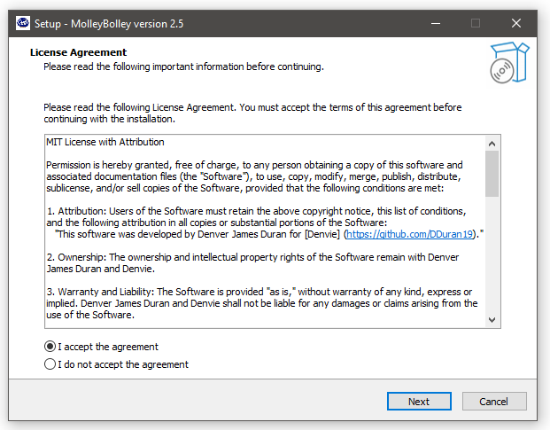

2. Choose the directory where you want to save the installation files.

   

3. Create a start menu shortcut for easy access to MolleyBolley.

   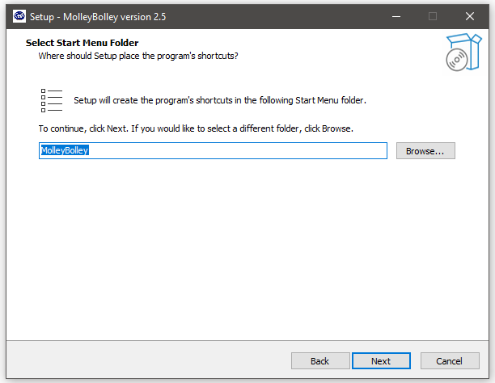

4. Optionally, create a desktop shortcut for even quicker access to the app.

   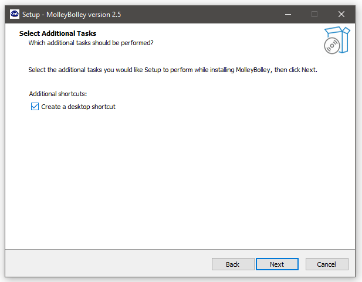

5. Click the "Install" button to begin the installation process.

   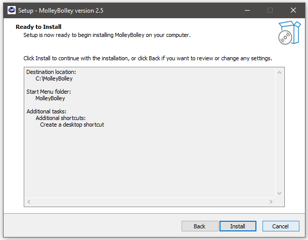

6. Wait for the installation to complete, and then launch MolleyBolley.

   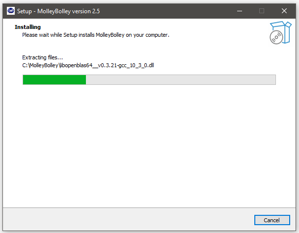

## Getting Started

To get started with MolleyBolley, follow these steps:

1. Log in with the credentials provided by the management.

   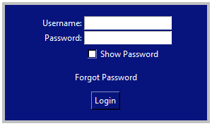

2. Upon successful login, you will see the main screen.

   

3. Familiarize yourself with the screen setup, which includes the Customer Queue table, Employee List table, Customer information section, Customer assignment, employee assignment, and the advertisement section.

   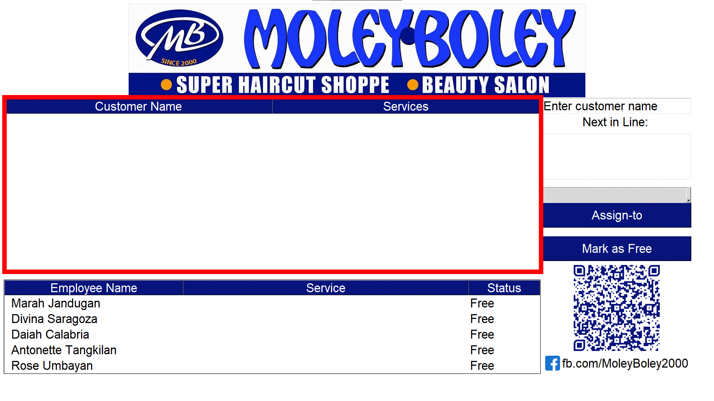

4. To add a customer, enter the customer's name in the provided space and select the services they want to avail. Click "Submit" to automatically add them to the queue.

   

5. You can add multiple customers, and the first customer in the queue will always be next in line. Select an available employee from the employee dropdown and click "Assign To".

   The customer will be removed from the queue and added to the "Service" column of the employee list. This indicates that the employee is currently serving this customer with the selected services. The employee's status will also change.

   The next customer in line will automatically become the first customer in the customer table.

   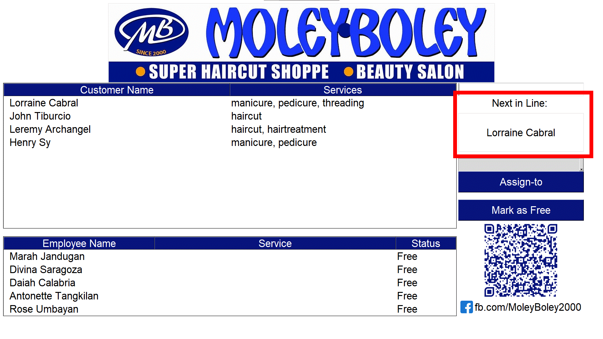

6. Once the services are complete, select the employee from the list and choose "Mark as Free". A popup window will appear, asking for all the services provided to the customer. You can modify the values based on the final result, considering any additional services requested or cancelled during the session.

   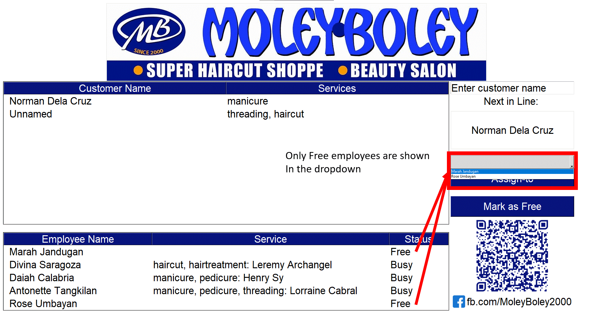

7. You can change your password in the settings panel by clicking the business logo on top. Just type in your new password twice and click the Change password button and you should be good to go. The exit button is also found on this window.

   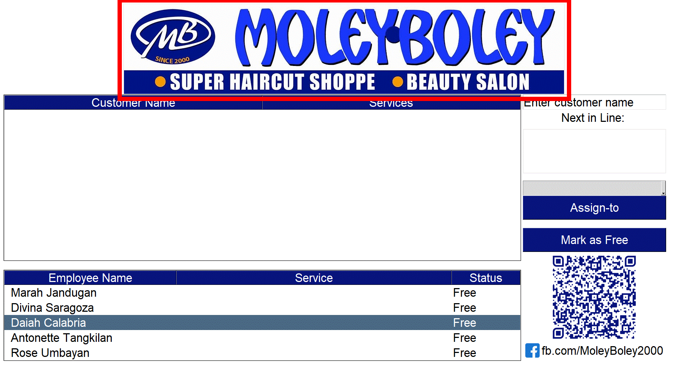

## Data Analysis

To analyze sales data and extract information, follow these steps:

1. For a quick analysis of today's running sales, you can double-click anywhere on the employee list table. This action will open a pop-up table displaying the total services rendered today, as well as the number of customers served per employee.

   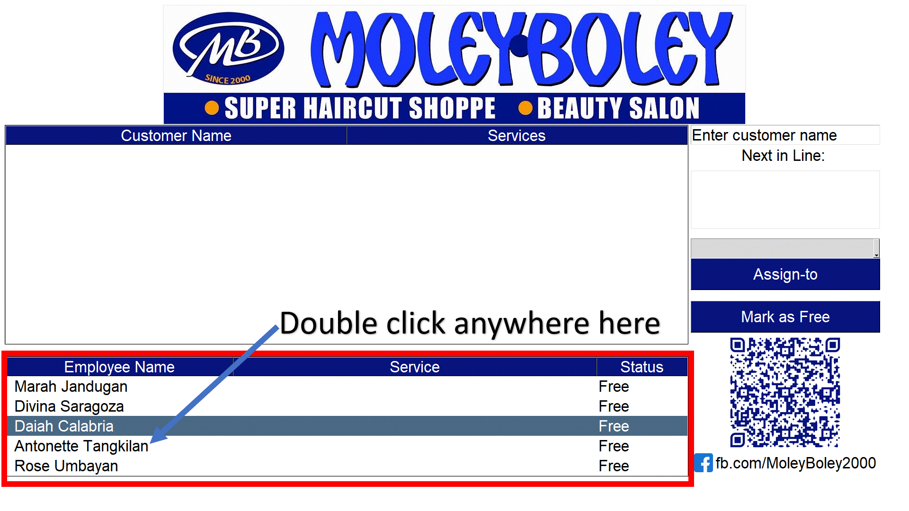

2. To extract data using an Excel file, click on the appropriate descriptive button below the Analysis Panel. This will open a save file dialog where you can choose the location to save the file.

   

## Employee Management

To manage employees and perform administrative tasks, follow these steps:

1. If you have administrative powers, you can change the password of non-admin employees. Simply click on the dropdown menu, select the employee, type in the new password twice, and click on "Change Password".

   

2. As an admin, you have the power to create a new employee. Fill in the necessary fields with the employee's information.

   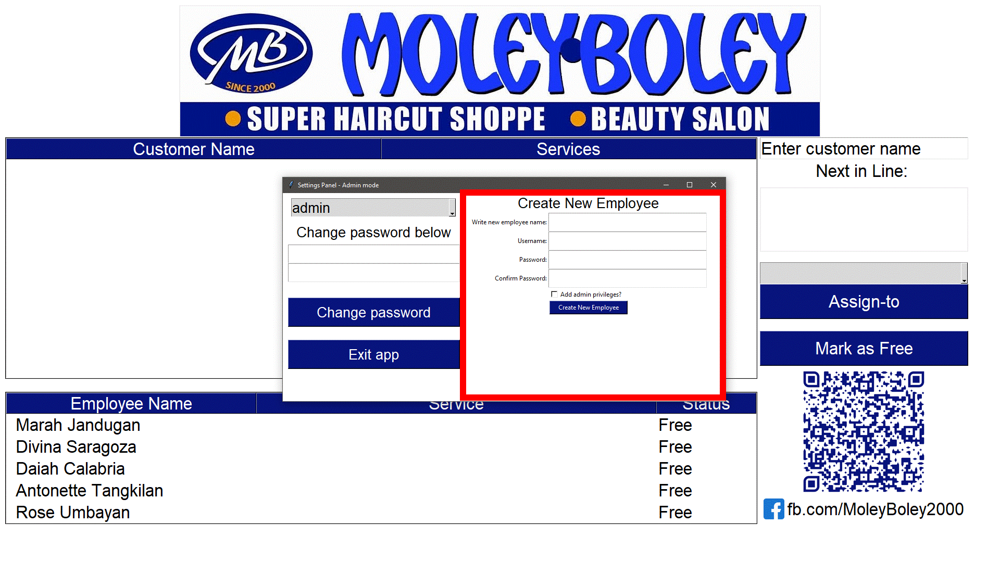

3. There is only one Owner account, so make sure not to lose it. As the owner, you have the capability to delete employees from the database, change admin roles of your employees, and modify their passwords.

   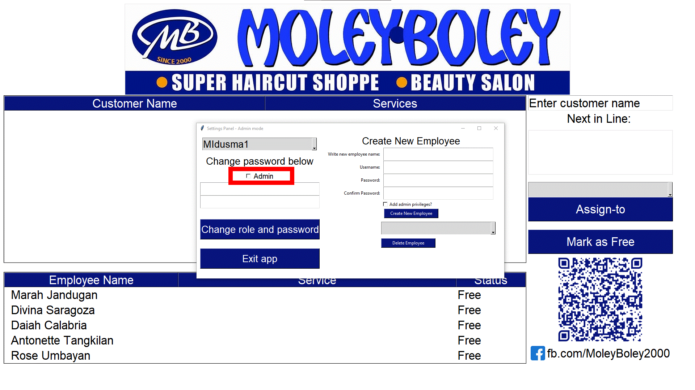
